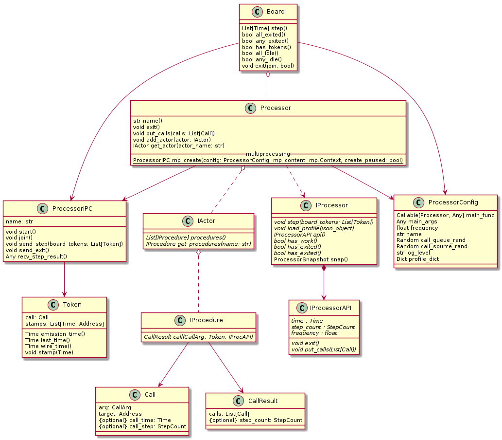

# PaCoS 
Pa(rallel) Co(mputation) S(imulator) 

# Class Diagram



# Running the examples
---

```
$ python -m pacos4.examples.all

=== pingpong-serial ===
WARNING: step: 1, pings_left: 3
WARNING: step: 3, pings_left: 2
WARNING: step: 5, pings_left: 1
=== pingpong-parallel ===
WARNING-18280: PING - time: 0.00e+00, pings_left: 3
WARNING-18281: PONG - time: 1.00e-09, pong
WARNING-18280: PING - time: 2.00e-09, pings_left: 2
WARNING-18281: PONG - time: 3.00e-09, pong
WARNING-18280: PING - time: 4.00e-09, pings_left: 1
WARNING-18281: PONG - time: 5.00e-09, pong
=== pingpong-parallel-slow_sim_hw ===
WARNING-18282: PING - time: 0.00e+00, pings_left: 3
INFO-18283: busy wait
WARNING-18283: PONG - time: 1.00e-09, pong
INFO-18283: busy wait
INFO-18283: busy wait
INFO-18283: busy wait
INFO-18283: busy wait
WARNING-18282: PING - time: 5.00e-09, pings_left: 2
WARNING-18283: PONG - time: 6.00e-09, pong
INFO-18283: busy wait
INFO-18283: busy wait
INFO-18283: busy wait
INFO-18283: busy wait
WARNING-18282: PING - time: 1.00e-08, pings_left: 1
WARNING-18283: PONG - time: 1.10e-08, pong
INFO-18283: busy wait
INFO-18283: busy wait
INFO-18283: busy wait
INFO-18283: busy wait
=== parallel-count ===
WARNING-18284: time: 0.00e+00, count: 0
WARNING-18285: time: 0.00e+00, count: 0
WARNING-18286: time: 0.00e+00, count: 0
WARNING-18286: time: 1.00e-09, count: 1
WARNING-18284: time: 1.00e-09, count: 1
WARNING-18285: time: 1.00e-09, count: 1
WARNING-18284: time: 2.00e-09, count: 2
WARNING-18286: time: 2.00e-09, count: 2
WARNING-18285: time: 2.00e-09, count: 2
1.039834580005845 s. (wall time)
=== timer-race ===
WARNING-18289: Sink received value: UNINITIALIZED
=== timer-race ===
WARNING-18292: Sink received value: UNINITIALIZED
=== timer-race ===
WARNING-18295: Sink received value: UNINITIALIZED
=== timer-race ===
WARNING-18298: Sink received value: UNINITIALIZED
=== timer-race ===
WARNING-18301: Sink received value: UNINITIALIZED
=== data-race ===
WARNING-18304: Sink received value: B
=== data-race ===
WARNING-18307: Sink received value: B
=== data-race ===
WARNING-18310: Sink received value: B
=== data-race ===
WARNING-18313: Sink received value: A
=== data-race ===
WARNING-18316: Sink received value: B
=== best-effort-race (best_effort_race_random.json) ===
WARNING-18320: Sink received value: [0, []] : INIT
WARNING-18320: Sink received value: [1, [1]] : DEGRADED
WARNING-18320: Sink received value: [2, [1, 1]] : HEALTHY
WARNING-18320: Sink received value: [3, [1]] : DEGRADED
WARNING-18320: Sink received value: [4, [1, 1, 1]] : HEALTHY
WARNING-18320: Sink received value: [5, [1]] : DEGRADED
WARNING-18320: Sink received value: [6, [1, 1]] : HEALTHY
WARNING-18320: Sink received value: [7, [1, 1]] : HEALTHY
WARNING-18320: Sink received value: [8, [1, 1]] : HEALTHY
WARNING-18320: Sink received value: [9, [1, 1]] : HEALTHY
WARNING-18320: Sink received value: [10, [1]] : DEGRADED
WARNING-18320: Sink received value: [11, [1]] : DEGRADED
WARNING-18320: Sink received value: [12, [1, 1, 1]] : HEALTHY
WARNING-18320: Sink received value: [13, [1, 1]] : HEALTHY
WARNING-18320: Sink received value: [14, [1, 1]] : HEALTHY
WARNING-18320: Sink received value: [15, [1, 1]] : HEALTHY
WARNING-18320: Sink received value: [16, [1, 1]] : HEALTHY
=== best-effort-race (best_effort_race_constant.json) ===
WARNING-18333: Sink received value: [0, []] : INIT
WARNING-18333: Sink received value: [1, [1]] : DEGRADED
WARNING-18333: Sink received value: [2, [1, 1]] : HEALTHY
WARNING-18333: Sink received value: [3, [1, 1, 1]] : HEALTHY
WARNING-18333: Sink received value: [4, [1, 1]] : HEALTHY
WARNING-18333: Sink received value: [5, [1, 1, 1]] : HEALTHY
WARNING-18333: Sink received value: [6, [1, 1]] : HEALTHY
WARNING-18333: Sink received value: [7, [1, 1, 1]] : HEALTHY
WARNING-18333: Sink received value: [8, [1, 1]] : HEALTHY
WARNING-18333: Sink received value: [9, [1, 1, 1]] : HEALTHY
WARNING-18333: Sink received value: [10, [1, 1]] : HEALTHY
WARNING-18333: Sink received value: [11, [1, 1, 1]] : HEALTHY
WARNING-18333: Sink received value: [12, [1, 1]] : HEALTHY
WARNING-18333: Sink received value: [13, [1, 1, 1]] : HEALTHY
WARNING-18333: Sink received value: [14, [1, 1]] : HEALTHY
WARNING-18333: Sink received value: [15, [1, 1, 1]] : HEALTHY
WARNING-18333: Sink received value: [16, [1, 1]] : HEALTHY
```

```
$ python -m pacos4.mock.mock --log WARNING ./pacos4/mock/mock1.pacos

=== mock1.pacos ===
WARNING-18492: timer.timer : 0
WARNING-18492: sink.sink : 0
WARNING-18492: timer.timer : 1
WARNING-18492: sink.sink : 1
WARNING-18492: timer.timer : 2
WARNING:Reached application time: 2.0
A.timer.timer 3
A.sink.sink 2
```

# Credits

* pacos.jpg is from https://pxhere.com/en/photo/87232
